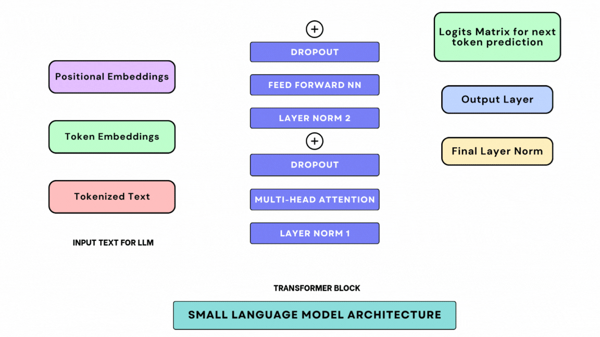

# Small Language Model (SLM) from Scratch 👩‍💻

  

A **Small Language Model (SLM)** trained on [TinyStories](https://huggingface.co/datasets/roneneldan/TinyStories) dataset to generate creative and coherent text.  
This project is implemented from scratch in **PyTorch**, inspired by the work of **Vizuara AI Labs**.  

---

## 🌟 Features

- Small-scale GPT-like architecture (~50-60M parameters)  
- Trained on TinyStories dataset (kid-friendly short stories)  
- Causal self-attention for next-token prediction  
- Mixed precision training for faster computation  
- Generate text given a prompt with controllable length and randomness  

---

## 🎯 Example Outputs

**Prompt:**
`Once upon a time there was a pumpkin.`

**Generated Text:**
`Once upon a time there was a pumpkin. It was orange and round, and everyone loved it. The pumpkin rolled around in the garden and made friends with the little mice...`

**Prompt:**
`A little girl went to the woods`

**Generated Text:**
`A little girl went to the woods. She saw the birds singing and the flowers blooming. Suddenly, she found a hidden path that led to a magical treehouse...`

---

## 🛠️ Technical Details

* **Model Architecture:** GPT-like small transformer
* **Layers:** 6
* **Heads:** 6
* **Embedding Size:** 384
* **Block size (context):** 128 tokens
* **Dataset:** TinyStories (HuggingFace)
* **Training:** Mixed precision (bfloat16/float16)
* **Optimizer:** AdamW with weight decay
* **Learning Rate Scheduler:** Linear warmup + Cosine decay

---

## 👏 Credits

* **Dataset:** [TinyStories by Ronen Eldan](https://huggingface.co/datasets/roneneldan/TinyStories)
* **Model Inspiration & Training Code:** [Vizuara AI Labs](https://www.vizuara.com/)
